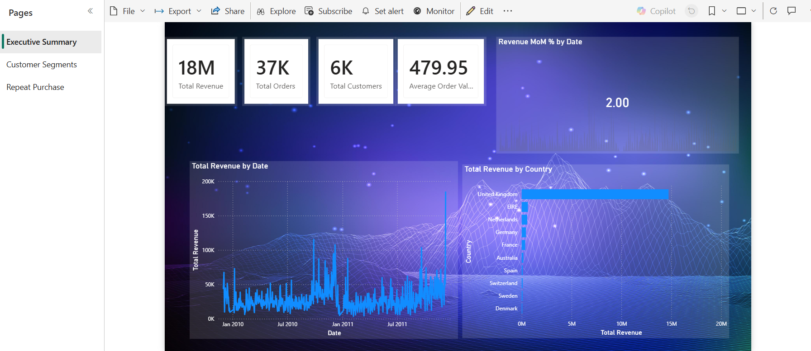
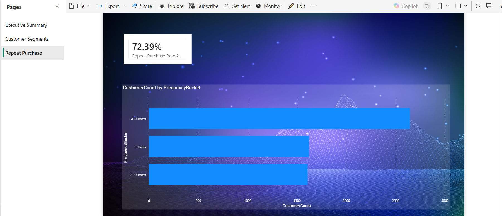

## Key Insights

- Champions (25.1% of customers) generate 69.5% of total revenue
  (£12.3M of £17.7M analyzed) — a small, high-value customer base
  drives the majority of the business.
- At Risk and Lost customers together make up 40% of the customer
  base but contribute only 13% of revenue, indicating a large group
  of low-engagement customers with limited current business impact.
- Loyal Customers (20.9% of customers, 15.6% of revenue) represent
  the most promising group to upgrade into Champions through targeted
  engagement, since they're already active but not yet top spenders.

## Recommendations

- Prioritize retention efforts (loyalty perks, personalized offers)
  on the Champions segment, since losing even a few of these
  customers has outsized revenue impact.
- Design a win-back campaign specifically for At Risk customers
  before they fully churn into Lost, since recovering them is
  cheaper than acquiring new customers.
- Focus growth marketing on converting Loyal Customers into
  Champions rather than acquiring entirely new customers, since
  they already show engagement.
  
## Power BI Dashboard

An interactive Power BI dashboard was built on top of this SQL analysis, covering:
- **Executive Summary:** Revenue, orders, customers, and average order value KPIs with monthly revenue trend and top countries by revenue
- **Customer Segments:** RFM-based segmentation (Champions, Loyal, At Risk, Lost, etc.) with customer count and revenue by segment
- **Repeat Purchase Analysis:** Repeat purchase rate and customer distribution by order frequency

🔗 **[View Live Dashboard](https://app.powerbi.com/groups/me/reports/1182783b-6715-49c1-bd88-097e650e5e5c/4e62768ed210ae1970d0?experience=power-bi)**

